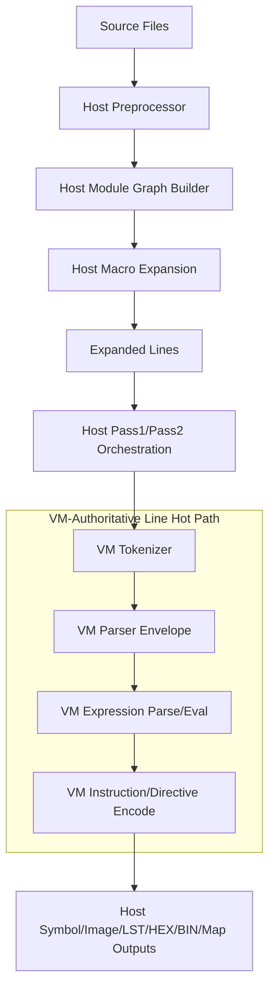
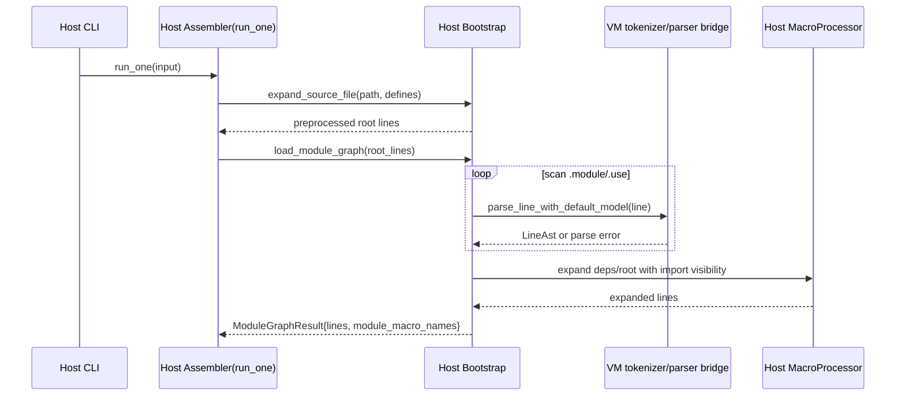
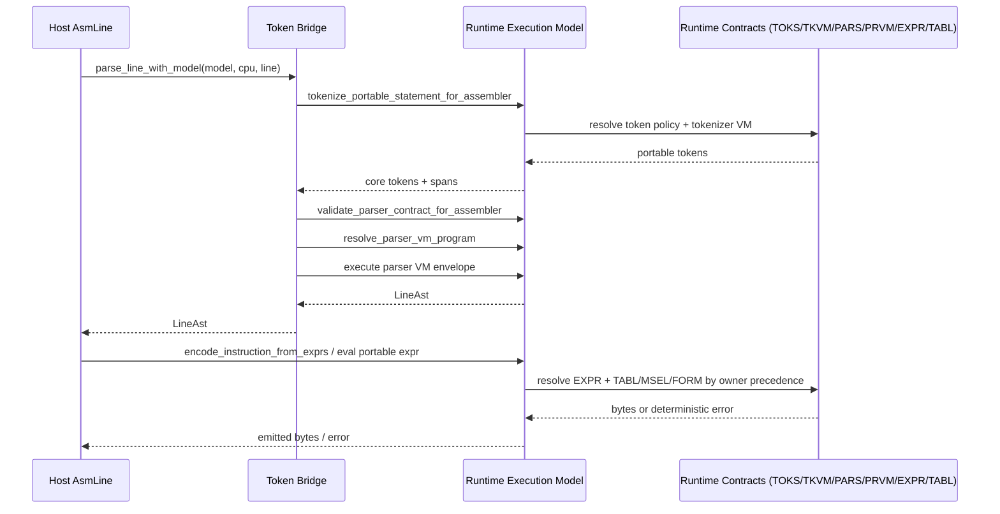

<!-- SPDX-License-Identifier: GPL-3.0-or-later -->

# VM Boundary & Protocol Specification (v1)

Status: active canonical spec  
Last updated: 2026-02-24

See also:
- [opForge Reference Manual](opForge-reference-manual.md) (Appendix: multi-CPU architecture)
- [VM Ultimate64 ABI Contract (v1)](vm-ultimate64-abi-contract-v1.md)

## 1. Purpose

This document normatively defines the host/VM boundary for the opForge VM integration.
It specifies:
- which responsibilities are host-owned vs VM-owned,
- where the host invokes VM contracts,
- strictness/fallback rules,
- rollout/override controls,
- and wire-level interaction patterns between host orchestration and the VM runtime model.

## 2. Scope

### 2.1 In scope
- Line-level assembly hot path: tokenization, parse envelope dispatch, expression parse/eval, instruction encode.
- Bootstrap path used before pass1/pass2: preprocessing, module graph loading, macro expansion, and module/use scanning.
- Runtime ownership precedence (`dialect -> cpu -> family`) and strictness behavior.
- Host override controls and their effects.

### 2.2 Out of scope
- CLI UX details unrelated to host/VM boundary semantics.
- Non-assembler tools that may consume VM packages (`*.opcpu`).
- Future full VM replacement of preprocessor/macro engines.

## 3. Canonical Boundary Matrix

| Stage | Owner | VM Used? | Normative Behavior |
|---|---|---|---|
| Preprocessor file expansion | Host | No | Host `Preprocessor` expands source/includes/defines before module graph assembly. |
| Module graph dependency traversal | Host | Yes (scanner) | Host builds graph/orchestration; line scans (`.module`, `.use`) are parsed using the default VM tokenizer/parser model. |
| Macro expansion | Host | No (engine) | Host `MacroProcessor` performs expansion/injection; VM is not the macro executor. |
| Per-line tokenization in assembler passes | VM | Yes | Per-line processing requires a runtime model and uses the VM tokenization path. |
| Per-line parser envelope | VM | Yes | Per-line parsing validates parser contracts and executes the parser VM envelope. |
| Expression parse/eval on assembly hot path | VM by default | Yes | Certified families default to VM expression parser/eval; strict contract/version checks are errors. |
| Instruction candidate resolution/encode | VM-first with strictness | Yes | VM encode path is authoritative for certified families; contract failures are explicit errors. |
| Pass orchestration, symbols, image/list/map output | Host | No | Host controls pass loop, symbol lifecycle, listings/map/hex/bin I/O. |

## 4. High-Level Architecture

## 5. Bootstrap Protocol (Host-Orchestrated, VM-Assisted Scanning)

Bootstrap entry (`run_one`) performs:
1. host preprocess,
2. host module graph load,
3. pass1/pass2 orchestration.

Within module graph load, host scanners parse lines using the default VM model for `.module` and `.use` extraction.

Normative note:
- VM is a scanner/parser service here, not the owner of module graph or macro expansion orchestration.

## 6. Assembly Hot Path Protocol (Host ↔ VM)

For each line in pass1/pass2, host uses VM-first parse/expr/encode contracts.

## 7. Ownership and Precedence

All runtime-resolved contracts are owner-scoped and resolved with this precedence:
1. dialect
2. cpu
3. family

This precedence applies uniformly to tokenizer policy/programs, parser contracts/programs, expression contracts, and encode tables/selectors.

## 8. Strictness and Failure Rules

Normative rules:
- Unknown/mismatched VM opcode versions are hard errors.
- Missing required VM program/contract for authoritative path is a hard error.
- Invalid VM output shape (for example empty non-comment token stream where forbidden) is a hard error.
- VM contract/version failures are never interpreted as soft host fallback signals.

Determinism requirements:
- Budget ceilings and diagnostics are deterministic for repeated runs over identical inputs.

## 9. Rollout Defaults and Override Controls

### 9.1 Current defaults (v1, active)
- Runtime/package path: authoritative for `mos6502` and `intel8080` families.
- Expression eval path: authoritative for `mos6502` and `intel8080` families.
- Expression parser path: authoritative for `mos6502` and `intel8080` families.

### 9.2 Host override controls

Environment controls recognized by assembler runtime:
- `OPFORGE_VM_EXPR_EVAL_OPT_IN_FAMILIES`
- `OPFORGE_VM_EXPR_EVAL_FORCE_HOST_FAMILIES`

Rules:
- `FORCE_HOST` disables default expression VM eval for matching family ids.
- `OPT_IN` enables expression VM eval for staged families.
- If both apply, `FORCE_HOST` wins.

Boundary caveat:
- These controls affect expression eval gating only.
- They do not replace host orchestration responsibilities (preprocess/module graph/macro/output orchestration).

## 10. Explicit Host Responsibilities (Non-VM)

The following remain host-owned by specification:
- Filesystem and module discovery.
- Preprocessor include/define expansion.
- Macro expansion and import visibility injection.
- Pass1/pass2 scheduling and line traversal.
- Symbol table lifecycle + diagnostics aggregation.
- Artifact emission (`.lst`, `.hex`, `.bin`, map/export/link outputs).

## 11. Compliance Criteria

An implementation is compliant with this spec when:
- The line hot path uses VM tokenizer/parser/expr/encode for authoritative families.
- Host orchestration boundary remains explicit as defined in Sections 3/10.
- Runtime precedence is `dialect -> cpu -> family`.
- Contract and opcode compatibility checks are enforced at runtime.
- Deterministic limits and diagnostics are preserved.

## 12. Supersession

This document supersedes prior VM boundary notes previously kept under `dev-docs/NextSteps`.
